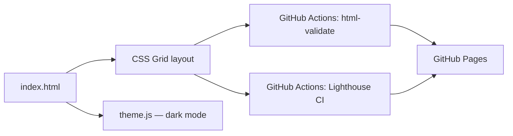

# portfolio-site

> The hub linking every shipped project — semantic HTML, CSS Grid/Flexbox, dark mode, accessible by default.

[](https://github.com/Prithv122/portfolio-site/actions/workflows/ci.yml)

**Live demo:** _link once deployed to GitHub Pages_
**Stack:** vanilla HTML5, CSS3 (Grid/Flexbox, custom properties), vanilla JS — no framework, no build step

---

## 1. The problem

A resume links to six-plus separate GitHub repos with no single page tying them together. Anyone
screening the portfolio — a recruiter, a hiring manager, an interviewer — needs one URL that
explains what the projects are, in plain language, before they'll click into any of them.

## 2. The data

Not data-driven — the "content" is the project catalog itself (name, one-line pitch, tech stack,
links) for each shipped repo, hand-written and updated as new projects ship.

## 3. Architecture



## 4. Key decisions & tradeoffs

| Decision | Chose | Over | Why |
|---|---|---|---|
| _..._ | _..._ | _..._ | _..._ |

_Filled in during the build once the layout and theming approach are actually implemented._

## 5. Results

| Metric | Value | Baseline | Notes |
|---|---|---|---|
| Lighthouse Performance | _..._ | 95 target | measured via `npm run lhci`, gated in CI |
| Lighthouse Accessibility | _..._ | 95 target | measured via `npm run lhci`, gated in CI |
| Lighthouse Best Practices | _..._ | 95 target | measured via `npm run lhci`, gated in CI |
| Lighthouse SEO | _..._ | 95 target | measured via `npm run lhci`, gated in CI |

_Numbers filled in once the site is built and `npm run lhci` has actually run against it._

## 6. How to run

```bash
git clone https://github.com/Prithv122/portfolio-site.git
cd portfolio-site
npm install
npm run validate   # HTML validation
npm run lhci        # Lighthouse CI (performance/a11y/best-practices/seo gate)
```

No build step — open `public/index.html` directly in a browser, or serve it with any static
file server (e.g. `npx serve public`).

## 7. What I'd change at 100× scale

A single hand-written `index.html` doesn't scale past a personal portfolio — at real scale
(e.g. a directory of hundreds of projects) this would move to a static-site generator with
templated project cards driven by a data file (JSON/YAML), so adding a project is a data edit,
not an HTML edit.

---

## References

None — standard semantic HTML/CSS/JS patterns, no reference implementation consulted.
