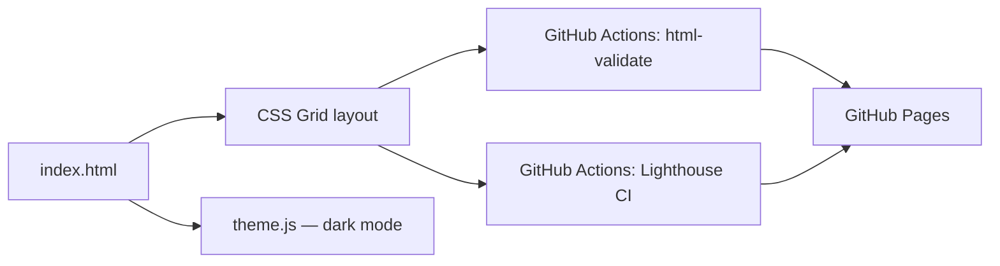

# portfolio-site

> The hub linking every shipped project — semantic HTML, CSS Grid/Flexbox, dark mode, accessible by default.

[](https://github.com/Prithv122/portfolio-site/actions/workflows/ci.yml)

**Live demo:** https://prithv122.github.io/portfolio-site/
**Stack:** vanilla HTML5, CSS3 (Grid/Flexbox, custom properties), vanilla JS — no framework, no build step

---

## 1. The problem

A resume links to six-plus separate GitHub repos with no single page tying them together. Anyone
screening the portfolio — a recruiter, a hiring manager, an interviewer — needs one URL that
explains what the projects are, in plain language, before they'll click into any of them.

## 2. The data

Not data-driven — the "content" is the project catalog itself (name, one-line pitch, tech stack,
links) for each shipped repo, hand-written and updated as new projects ship.

## 3. Architecture



## 4. Key decisions & tradeoffs

| Decision | Chose | Over | Why |
|---|---|---|---|
| Scaffold | Hand-built static-site structure (`public/` deploy root + npm dev-only tooling) | The portfolio's default `_template/` (uv + pyproject.toml + pytest) | This project has zero Python; forcing a Python scaffold onto an HTML/CSS/JS site would be dead weight for the sake of consistency. |
| "Tests" | HTML validation (`html-validate`) + Lighthouse CI gated at ≥95 on all four categories | A JS test framework (Jest/Vitest) with DOM assertions | There's no application logic to unit-test — a ~20-line dark-mode toggle. Validity and measured Lighthouse scores are the correctness properties that actually matter for a static site, and they're CI-enforced, not just eyeballed. |
| Theming | CSS custom properties + `prefers-color-scheme` media query, JS only writes a `data-theme` override to `localStorage` | A JS-only theme system that sets all colors via inline styles | CSS handles the default (system preference) with zero JavaScript and no flash for the common case; JS is only in the critical path when a visitor explicitly overrides their system preference. |
| Deploy root | `public/` subdirectory, not repo root | Deploying the whole repo root via `actions/upload-pages-artifact` | Keeps `README.md`, `NOTES.md`, `package.json`, etc. out of the public site — only what's meant to be served is served. |
| Card copy | Hand-written one-line pitches + real measured numbers pulled from each repo's own README/PROGRESS notes (test counts, coverage, measured speedups) | Auto-generating cards from the GitHub API (repo description, stars) | The GitHub API has no place to put "25–28× faster than naive hashing, measured" — the numbers that actually make a project's README convincing are exactly what a generic API-driven card would drop. |

## 5. Results

| Metric | Value | Baseline | Notes |
|---|---|---|---|
| Lighthouse Performance | 100 | 95 target | measured in CI via `npm run lhci` against the built `public/` directory |
| Lighthouse Accessibility | 100 | 95 target | measured in CI via `npm run lhci` |
| Lighthouse Best Practices | 100 | 95 target | measured in CI via `npm run lhci`; caught and fixed a missing-favicon 404 that had been costing points |
| Lighthouse SEO | 100 | 95 target | measured in CI via `npm run lhci` |

_All four scores are asserted in CI (`lighthouserc.json`, ≥0.95 on each), not just measured
once locally — a regression fails the build. See the `CI` workflow run on the latest commit
for the actual numbers._

## 6. How to run

```bash
git clone https://github.com/Prithv122/portfolio-site.git
cd portfolio-site
npm install
npm run validate   # HTML validation
npm run lhci        # Lighthouse CI (performance/a11y/best-practices/seo gate)
```

No build step — open `public/index.html` directly in a browser, or serve it with any static
file server (e.g. `npx serve public`).

## 7. What I'd change at 100× scale

A single hand-written `index.html` doesn't scale past a personal portfolio — at real scale
(e.g. a directory of hundreds of projects) this would move to a static-site generator with
templated project cards driven by a data file (JSON/YAML), so adding a project is a data edit,
not an HTML edit.

---

## References

None — standard semantic HTML/CSS/JS patterns, no reference implementation consulted.
